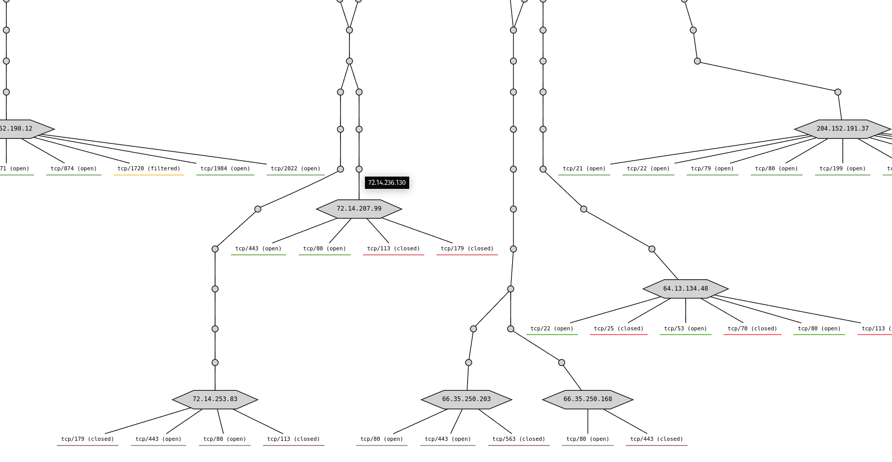

# NMAP-Formatter


[](https://codecov.io/gh/vdjagilev/nmap-formatter)
[](https://codeclimate.com/github/vdjagilev/nmap-formatter/maintainability)

---

## Examples

HTML:

Graphviz:


A tool that allows you to convert NMAP XML output to excel/html/csv/json/markdown/dot/sqlite/d2.

## Installation

```
go install github.com/vdjagilev/nmap-formatter/v3@latest
cd nmap-formatter
go build
```

All other options can be found on [Installation Wiki page](https://github.com/vdjagilev/nmap-formatter/wiki/Installation).

## Usage

```bash
nmap-formatter [html|csv|md|json|dot|sqlite|excel|d2] [path-to-nmap.xml] [flags]
```

Or alternatively you can read file from `stdin` and parse it

```bash
cat some.xml | nmap-formatter json
```

Convert XML output to nicer HTML

```bash
nmap-formatter html [path-to-nmap.xml] > some-file.html
```

or Markdown

```bash
nmap-formatter md [path-to-nmap.xml] > some-markdown.md
```

or Excel

```bash
nmap-formatter excel [path-to-nmap.xml]
```

or JSON

```bash
nmap-formatter json [path-to-nmap.xml]
# This approach is also possible
cat nmap.xml | nmap-formatter json
```

or Graphviz (dot)

```bash
cat example.xml | nmap-formatter dot | dot -Tsvg > test.svg
# open test.svg with browser
```

or SQLite

```bash
cat example.xml | nmap-formatter sqlite --sqlite-dsn nmap.sqlite
# open nmap.sqlite with any database tool
```

or D2 lang

```bash
cat example.xml | nmap-formatter d2 | d2 - example.png
# Converts nmap.xml to d2 language and then to png
```

More examples can be found on [Usage Wiki page](https://github.com/vdjagilev/nmap-formatter/wiki/Usage)

### Flags

- `-f, --file [filename]` outputs result to the file (by default output goes to STDOUT)
- `--help` display help message
- `--version` display version (also can be used: `./nmap-formatter version`)
- `--skip-down-hosts` skip hosts that are down (by default `true`)

It's also possible to change various output options. More examples on [Usage Wiki Page - Flags](https://github.com/vdjagilev/nmap-formatter/wiki/Usage#flags-and-output-options).

Screenshots of various formats available [here](https://github.com/vdjagilev/nmap-formatter/wiki/Examples)

## Use as a library

Examples on how to use this project as a library in golang: [Use as a library Wiki page](https://github.com/vdjagilev/nmap-formatter/wiki/Use-as-a-library)
