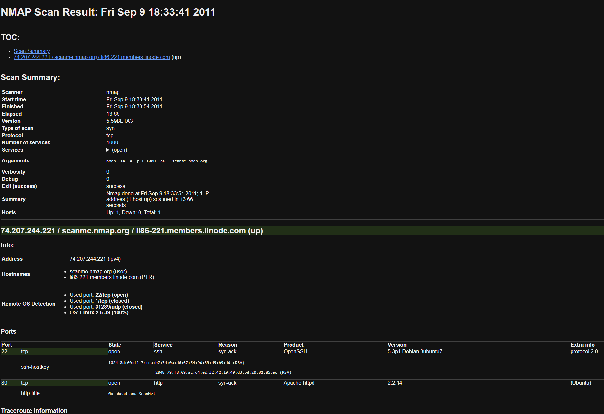

# NMAP-Formatter


[](https://codecov.io/gh/vdjagilev/nmap-formatter)
[](https://codeclimate.com/github/vdjagilev/nmap-formatter/maintainability)

---

A tool that allows you to convert NMAP XML output to html/csv/json/markdown.

## Table of Contents

- [NMAP-Formatter](#nmap-formatter)
  - [Table of Contents](#table-of-contents)
  - [Usage](#usage)
    - [Flags](#flags)
      - [Output Options](#output-options)
	- [Installation](#installation)
		- [Using Go](#using-go)
    	- [Docker](#docker)
    	- [Download Binary](#download-binary)
    	- [Compile](#compile)
  - [Example](#example)
  - [Use as a library](#use-as-a-library)

## Usage

```bash
nmap-formatter [html|csv|md|json] [path-to-nmap.xml] [flags]
```

Or alternatively you can read file from `stdin` and parse it

```bash
cat some.xml | nmap-formatter json
```

Convert XML output to nicer HTML

```bash
nmap-formatter html [path-to-nmap.xml] > some-file.html
```

or Markdown

```bash
nmap-formatter md [path-to-nmap.xml] > some-markdown.md
```

or JSON

```bash
nmap-formatter json [path-to-nmap.xml]
# This approach is also possible
cat nmap.xml | nmap-formatter json
```

It can be also combined with a `jq` tool

```bash
cat nmap.xml | nmap-formatter json | jq
```

List all the found ports and count them:

```bash
nmap-formatter json [nmap.xml] | jq -r '.Host[]?.Port[]?.PortID' | sort | uniq -c
```

```
    1 "22"
    2 "80"
    1 "8080"
```

another example where only those hosts are selected, which have port where some http service is running:

```bash
nmap-formatter json [nmap.xml] | jq '.Host[]? | . as $host | .Port[]? | select(.Service.Name== "http") | $host.HostAddress.Address' | uniq -c
```

```
    1 "192.168.1.1"
    1 "192.168.1.2"
    2 "192.168.1.3"
```

In this case `192.168.1.3` has 2 http services running (for example on ports 80 and 8080)`.

Another example where it is needed to display only filtered ports:

```bash
nmap-formatter json [nmap.xml] | jq '.Host[]?.Port[]? | select(.State.State == "filtered") | .PortID'
```

Display host IP addresses that have filtered ports:

```bash
nmap-formatter json [nmap.xml] | jq '.Host[]? | . as $host | .Port[]? | select(.State.State == "filtered") | .PortID | $host.HostAddress.Address'
```

### Flags

* `-f, --file [filename]` outputs result to the file (by default output goes to STDOUT)
* `--help` display help message
* `--version` display version (also can be used: `./nmap-formatter version`)

#### Custom Options

Custom options can be used to deliver some information to the output (like user ID, or environment or hostname where scan has been performed). For this purpose there is `--x-opts` flag exists. It's possible to use multiple variables:

```bash
nmap-formatter md nmap-file.xml --x-opts="Hostname=$HOST" --x-opts="Terminal=$TERM"
```

The end result would contain those values after `Scan Summary` chapter. It would look something like this:

| Key | Value |
| --- | ----- |
| **Hostname** | `hostname123` |
| **Terminal** | `xterm-256color` |

This command is applicable only in HTML & Markdown templates.

#### Output Options

##### HTML

| Flag | Description | Default | Example         |
| ---- | ----------- | ------- | --------------- |
| `--html-skip-down-hosts` | Skip hosts that are down (offline/unable to connect), so they won't be shown in the output | `true` | `--html-skip-down-hosts=false` |
| `--html-skip-summary` | Skip summary, it won't show various meta information about the scan | `false` | `--html-skip-summary=false` |
| `--html-skip-traceroute` | Skip traceroute information (from the machine that ran nmap to the target) | `false` | `--html-skip-traceroute=false` | 
| `--html-skip-metrics` | Skip miscellaneous metrics information | `false` | `--html-skip-metrics=true` |
| `--html-skip-port-scripts` | Skip port scripts output (nse-scripts) | `false` | `--html-skip-port-scripts=false` |
| `--html-use-template` | Use specific HTML template instead of default one | `""` | `--html-use-template /path/to/template.html` |

##### Markdown

| Flag | Description | Default | Example         |
| ---- | ----------- | ------- | --------------- |
| `--md-skip-down-hosts` | Skip hosts that are down (offline/unable to connect), so they won't be shown in the output | `true` | `--md-skip-down-hosts=false` |
| `--md-skip-summary` | Skip summary, it won't show various meta information about the scan | `false` | `--md-skip-summary=false` |
| `--md-skip-traceroute` | Skip traceroute information (from the machine that ran nmap to the target) | `false` | `--md-skip-traceroute=false` |
| `--md-skip-metrics` | Skip miscellaneous metrics information | `false` | `--md-skip-metrics=true` |
| `--md-skip-port-scripts` | Skip port scripts output (nse-scripts) | `false` | `--md-skip-port-scripts=false` |
| `--md-use-template` | Use specific Markdown template instead of default one | `""` | `--md-use-template /path/to/template.md` |

##### CSV

| Flag | Description | Default | Example         |
| ---- | ----------- | ------- | --------------- |
| `--csv-skip-down-hosts` | Skip hosts that are down (offline/unable to connect), so they won't be shown in the output | `true` | `--csv-skip-down-hosts=false` |

##### JSON

| Flag | Description | Default | Example         |
| ---- | ----------- | ------- | --------------- |
| `--json-pretty` | Pretty print of JSON output | `false` | `--json-pretty=true` |

## Installation

### Using Go

```
go install github.com/vdjagilev/nmap-formatter@latest
```

### Docker

No installation needed, just run `docker run`:

```
docker run -v /path/to/xml/file.xml:/opt/file.xml ghcr.io/vdjagilev/nmap-formatter:latest json /opt/file.xml
```

### Download Binary

Choose version from Release page and download it:

```
curl https://github.com/vdjagilev/nmap-formatter/releases/download/v0.3.2/nmap-formatter-linux-amd64.tar.gz --output nmap-formatter.tar.gz -L
tar -xzvf nmap-formatter.tar.gz
./nmap-formatter --help
```

### Compile

```
git clone git@github.com:vdjagilev/nmap-formatter.git
cd nmap-formatter
go mod tidy
go build
# or 
go run . html path/to/nmap.xml
```

## Example

Example of HTML generated output from (https://nmap.org/book/output-formats-xml-output.html)

```
nmap-formatter html basic-example.xml
```



## Use as a library

How to parse nmap results using golang

```go
package main

import (
	"encoding/xml"
	"os"

	"github.com/vdjagilev/nmap-formatter/formatter"
)

func main() {
	var nmap formatter.NMAPRun
	var config formatter.Config = formatter.Config{}

	// Read XML file that was produced by nmap (with -oX option)
	content, err := os.ReadFile("example.xml")
	if err != nil {
		panic(err)
	}
	// Unmarshal XML and map structure(s) fields accordingly
	if err = xml.Unmarshal(content, &nmap); err != nil {
		panic(err)
	}

	// Output data to console stdout
	// You can use any other io.Writer implementation
	// for example: os.OpenFile("file.json", os.O_CREATE|os.O_EXCL|os.O_WRONLY, os.ModePerm)
	config.Writer = os.Stdout
	// Formatting data to JSON, you can use:
	// CSVOutput, MarkdownOutput, HTMLOutput as well
	config.OutputFormat = formatter.JSONOutput

	// Setting formatter data/options
	templateData := formatter.TemplateData{
		NMAPRun: nmap, // NMAP output data itself
		OutputOptions: formatter.OutputOptions{
			JSONPrettyPrint: true, // Additional option to prettify JSON
		},
	}

	// New formatter instance
	formatter := formatter.New(&config)
	if formatter == nil {
		// Not json/markdown/html/csv
		panic("wrong formatter provided")
	}

	// Attempt to format the data
	if err = formatter.Format(&templateData); err != nil {
		// html template could not be parsed or some other issue occured
		panic(err)
	}
}

```